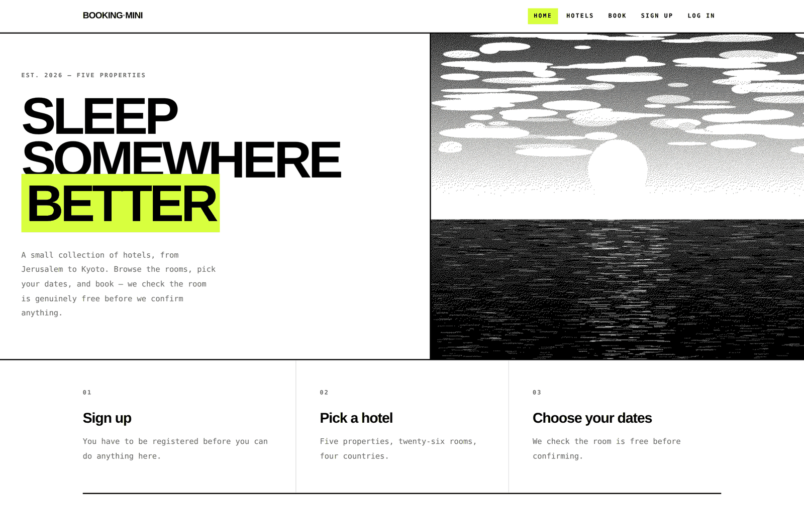
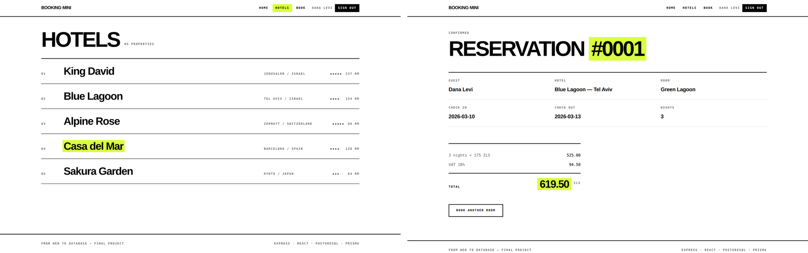

# BookingMini

A small hotel reservation site: browse hotels and rooms, pick your dates, and
book — with the system checking the room is genuinely free before it confirms.

Built as the final project for the *From Web to Database* course.



| | |
|---|---|
| **Database** | PostgreSQL |
| **ORM** | Prisma |
| **Server** | Node.js + Express |
| **Auth** | JWT + bcrypt |
| **Client** | React + React Router |
| **Styling** | Tailwind v4 |



---

## How it works

### Deciding whether a room is free

This is the one genuinely interesting problem in the project. A room is taken
when an existing reservation **overlaps** the requested range — and the rule is
easier to derive backwards, by describing when two ranges *do not* meet and
inverting that.

```
existing reservation:        [==== 10.3 ─────── 13.3 ====]

  12.3 → 15.3                          [==========]           taken
  13.3 → 15.3                                [=======]        free
  05.3 → 10.3         [=========]                             free
  01.3 → 20.3      [==================================]       taken
```

```
overlap  ⟺  existing.start < requested.end
        AND  existing.end   > requested.start
```

Note the second case: someone checking out on the 13th and someone checking in
on the 13th do not collide, which is why the comparison is strict.

The same rule runs in two places — the availability search, and the check before
a reservation is written. In Prisma it reads as "no reservation may exist that…":

```js
const rooms = await prisma.room.findMany({
  where: {
    reservations: {
      none: {
        AND: [
          { startDate: { lt: toDate(end_date) } },
          { endDate:   { gt: toDate(start_date) } },
        ],
      },
    },
  },
});
```

### Every input is checked twice

Once in the browser, so the answer is immediate, and again on the server,
because the browser can be bypassed entirely:

```bash
curl -X POST localhost:8000/api/reservations \
  -H "Authorization: Bearer $TOKEN" -H "Content-Type: application/json" \
  -d '{"start_date":"2026-02-31","end_date":"2026-03-05", ...}'

→ 400 { "error": "invalid_dates" }
```

`2026-02-31` is worth a mention: `new Date("2026-02-31")` does not throw — it
quietly rolls over to the 3rd of March. The check converts the date back to a
string and compares it to the input, so a date that was silently "corrected"
is rejected.

### Errors name the page that shows them

A failed reservation answers with one of three strings — `invalid_dates`,
`invalid_room`, `unavaliable_room` — and each is the name of a route in the
client, so the form needs no lookup table:

```js
if (PAGE_ERRORS.includes(err.reason)) navigate(`/${err.reason}`);
```

### A reservation records what happened

`guestName`, `pricePerNight` and `totalPrice` are stored on the reservation
rather than read back through the room, so a later price change cannot alter an
old confirmation, and a booking can be made in someone else's name.

---

## The API

Everything runs on one address: Express serves the built React app and the API
together, so the site and `POST /api/hotel/` share `127.0.0.1:8000`.

| Method | Route | Auth | |
|---|---|:--:|---|
| POST | `/api/users/signup` | — | create an account |
| POST | `/api/users/login` | — | returns a JWT |
| POST | `/api/hotel/` | — | add a hotel |
| POST | `/api/room/` | — | add a room |
| GET | `/api/available_rooms/` | — | free rooms between two dates |
| GET | `/api/hotels` | ✓ | every hotel |
| GET | `/api/hotels/:id` | ✓ | one hotel with its rooms |
| GET | `/api/rooms` | ✓ | every room |
| GET | `/api/rooms/:id` | ✓ | one room |
| POST | `/api/reservations` | ✓ | make a reservation |
| GET | `/api/reservations/:id` | ✓ | read one back |

Ready-made requests for all of them are in [`requests.http`](requests.http)
(VS Code REST Client) and [`postman_collection.json`](docs/postman_collection.json).

---

## A known limitation

**Concurrent bookings of the same room can both succeed.** The availability
check and the write are two separate statements, so two requests arriving in the
same instant can both pass the check before either has written.

Under real load this belongs in the database — a Postgres `EXCLUDE` constraint
over a date range would make the database itself reject the overlap. At this
project's scale the check stays in application code, deliberately.

---

## Running it

```bash
git clone https://github.com/danihadani/hotel-booking-project
cd hotel-booking-project/server
cp .env.example .env          # point DATABASE_URL at your PostgreSQL
npm install
npx prisma migrate dev        # creates the tables
npm run seed                  # 5 hotels, 26 rooms, 2 users
npm start

cd ../client && npm install && npm run build
```

Then open **http://127.0.0.1:8000** — sign in as `dana` / `123456`.

Full setup notes, including Windows and a database you may already have, are in
[`docs/SETUP.md`](docs/SETUP.md).

---

## Layout

```
server/
├── server.js               every route, in one file
├── auth.js                 bcrypt, JWT, and the login guard
├── prisma/schema.prisma    four models: User, Hotel, Room, Reservation
└── seed.js                 demo data, in one command

client/src/
├── App.jsx                 routing only
├── api.js                  every call to the server, with the token attached
├── auth.js                 the token, in localStorage
└── components/             fourteen files: pages and interface pieces

tools/
├── make_hero.py            draws the banner image
└── dither.py               reduces it to pure black and white
```

The banner on the home page is not a photograph — it is drawn by
`tools/make_hero.py` and dithered to one-bit black and white, so the project
carries no image it did not produce itself.
